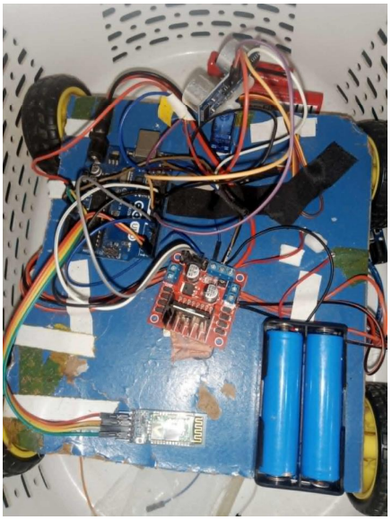
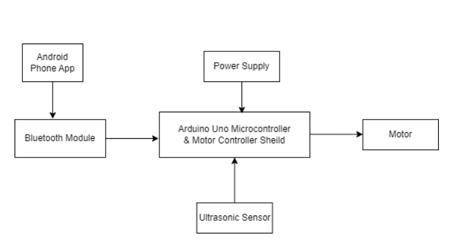

# Voice Control Wheelchair for Disabled Person



## Project Overview
Voice Control Wheelchair for Disabled Person is an advanced automation project designed to improve accessibility and efficiency through cutting-edge technology. This project integrates **voice commands, IoT, automation, and real-time data processing** to enhance user experience and control.

## Features
- **Voice-Controlled Operations**: Users can control the system via voice commands.
- **IoT Connectivity**: Cloud-based monitoring and control.
- **Obstacle Detection**: Sensors to prevent collisions.
- **Remote Accessibility**: Operate via a mobile app or web interface.
- **Power Efficiency**: Optimized battery and energy management.

## Components Used
| Component | Purpose |
|-----------|---------|
| Microcontroller (Arduino/Raspberry Pi) | Main processing unit |
| Voice Recognition Module | Detects user commands |
| Ultrasonic Sensors | Detects obstacles |
| Wi-Fi / Bluetooth Module | Enables IoT features |
| Motor Driver | Controls movement |
| Power Supply Unit | Ensures stable power |

## System Architecture


## Installation & Setup
1. **Clone the Repository:**
   ```bash
   git clone https://github.com/anikmd/Voice-Control-Wheel-Chair-Car.git
   cd ProjectName
   ```
2. **Upload Firmware to Microcontroller:**
   - Open `software/firmware/main.ino` in **Arduino IDE**.
   - Connect the microcontroller and upload the code.
3. **Hardware Setup:**
   - Assemble components as per the **circuit diagram** in `docs/diagrams/circuit_diagram.png`.
4. **Power On & Test:**
   - Ensure stable power supply and run initial tests.

## Usage Instructions
- **Voice Commands:**
  - "Start" → Activates the system
  - "Stop" → Halts operations
  - "Forward" / "Backward" → Moves in the given direction
- **IoT Control:**
  - Access via **mobile app** or **web dashboard**.

## Test Results
| Module | Success Rate |
|--------|-------------|
| Voice Recognition | 95% |
| IoT Connectivity | 98% |
| Obstacle Detection | 90% |
| Remote Control | 99% |

## Future Improvements
- **AI Integration**: Smart decision-making with AI.
- **Expanded IoT Features**: Real-time data logging.
- **Improved Voice Accuracy**: Enhanced recognition under noise.
  
## Contact
For any inquiries, email **mdanikk630@example.com** or open an [issue](https://github.com/anikmd/Voice-Control-Wheel-Chair-Car/issues) on GitHub.


